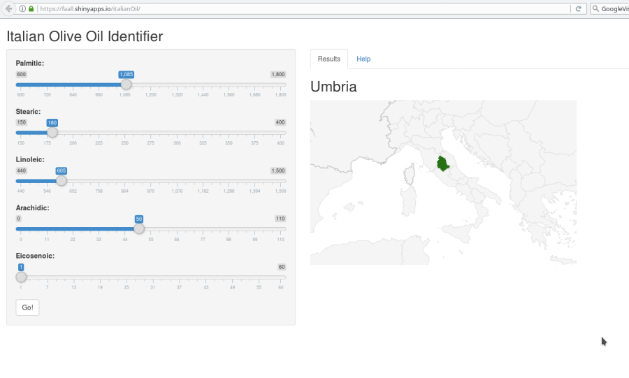

## Presentation

This application is meant to be a quick tool to identify the origin of Italian olive oils based on the sample's analysis of fatty acids.

To speed up the sample analysis the application will only require 5 fatty acids measurements as inputs achieving a 93.75% accuracy.

The application is web based, access is easy from anywhere and it features a clean, intuitive  interface for quick input and result presentation.


---

## User Interface



---

## How to

The app has a very straightforward use:

1. Move the sliders of each fatty acid to the appropriate value.
2. Press the `Go!` button
  

The main panel will refresh and show the name of the producing area and the map will highlight the province where the area belongs.
  

The user can select the `Help` tab in the main panel for more details, including sample values.

---

## Behind the scenes

```{r, echo=FALSE, warning=FALSE}
require(caret)
require(gbm)
require(plyr)
load("../model.rda")
```

Essentially, the front-end of the app passes the values for the different fatty acids to the  server side where they are fed to a previously generated model:

```{r, warning=FALSE}
userInput <- data.frame(Palmitic = 1116, Stearic = 231, Linoleic = 1168, 
                        Arachidic = 66, Eicosenoic = 1)

predict(gbm3, userInput)
```

The model returns then the Area where the olive oil was produced to be shown in the map provided by googleVis.

*For more details on the model construction click* [here](https://faall.github.io/ProgrammingAssignment9_4/ItalianOilEDA.html)
